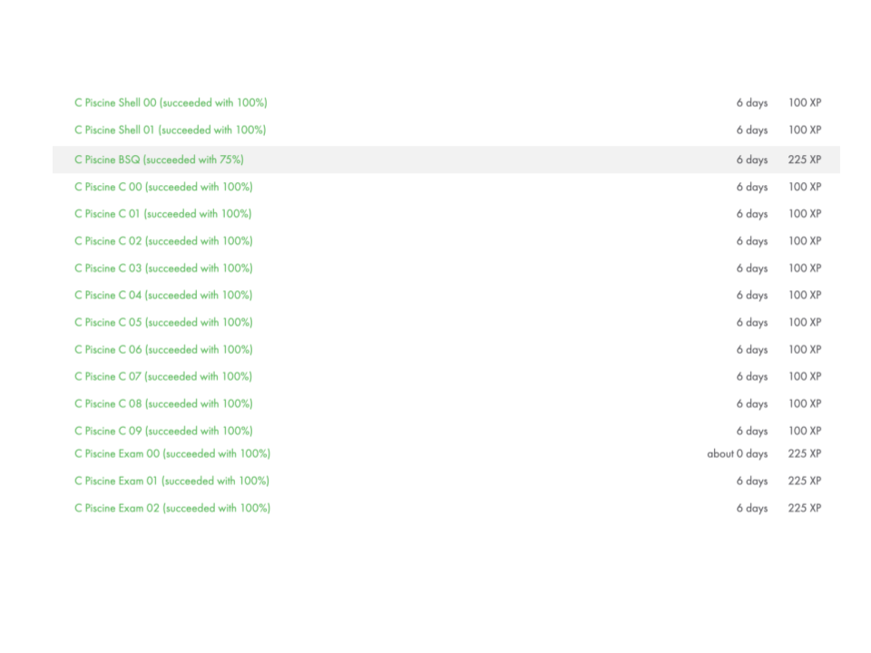

# 42 Heilbronn Piscine Projects

This repository contains all the projects I completed during my piscine at 42 Heilbronn. Below are the scores for each project.

# Projects Status

| Project | Final grade | All done |
|:-------:|:-----:|:------:|
| [Shell00](https://github.com/fredch16/42HeilbronnPiscine/tree/main/Shell00) | 100% | ✅ |
| [Shell01](https://github.com/fredch16/42HeilbronnPiscine/tree/main/Shell01) | 100% | ✅ |
| [C00](https://github.com/fredch16/42HeilbronnPiscine/tree/main/C00) | 100% | ✅ |
| [C01](https://github.com/fredch16/42HeilbronnPiscine/tree/main/C01) | 100% | ✅ |
| [C02](https://github.com/fredch16/42HeilbronnPiscine/tree/main/C02) | 85% | ✅ |
| [C03](https://github.com/fredch16/42HeilbronnPiscine/tree/main/C03) | 100% | ✅ |
| [C04](https://github.com/fredch16/42HeilbronnPiscine/tree/main/C04) | 80% | ✅ |
| [C05](https://github.com/fredch16/42HeilbronnPiscine/tree/main/C05) | 85% | ✅ |
| [C06](https://github.com/fredch16/42HeilbronnPiscine/tree/main/C06) | 100% | ✅ |
| [C07](https://github.com/fredch16/42HeilbronnPiscine/tree/main/C07) | 60% | ✅ |
| [C08](https://github.com/fredch16/42HeilbronnPiscine/tree/main/C08) | 100% | ✅ |
| [C09](https://github.com/fredch16/42HeilbronnPiscine/tree/main/C09) | 100% | ✅ |
| [C10](https://github.com/fredch16/42HeilbronnPiscine/tree/main/C10) | :x: | :x: |
| [C11](https://github.com/fredch16/42HeilbronnPiscine/tree/main/C11) | :x: | ✅ |
| [C12](https://github.com/fredch16/42HeilbronnPiscine/tree/main/C12) | :x: | :x: |
| [C13](https://github.com/fredch16/42HeilbronnPiscine/tree/main/C13) | :x: | :x: |
| [Rush00](https://github.com/fredch16/42HeilbronnPiscine/tree/main/Rush00) | :x: | ✅ |
| [Rush01](https://github.com/fredch16/42HeilbronnPiscine/tree/main/Rush01) | :x: | ✅ |
| [BSQ](https://github.com/fredch16/42HeilbronnPiscine/tree/main/BSQ) | 75% | ✅ |